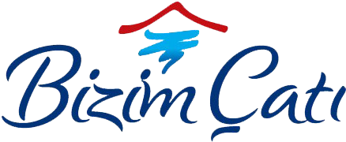

# Bizim Cati Hotel/Restaurant Website
<p align="center">
  
</p>

[](LICENSE.txt)

This is a modern, responsive website developed for a hotel/restaurant client. Built with React, Vite, and Tailwind CSS, the site supports 4 languages to effectively cater to a diverse audience. Visit the live website at [bizimcati.com.tr](https://bizimcati.com.tr).

## Overview

Developed primarily by me as a real-life project for a customer, Bizimcati features a clean, professional design with an engaging user experience. The website is fully responsive and optimized for desktops, tablets, and mobile devices. Its multilingual support allows the business to reach a broader market.

## Technologies Used

- **React:** For building the dynamic user interface.
- **Vite:** A fast build tool for modern web development.
- **Tailwind CSS:** For efficient, responsive styling.
- **i18n:** Implemented for support across 5 languages.

## Features

- **Responsive Design:** Seamless user experience on all devices.
- **Multilingual Support:** Available in 5 languages to cater to international visitors.
- **Modern UI/UX:** Clean, professional design tailored for the hospitality industry.
- **Real-life Application:** Developed as a complete project for a restaurant/hotel client.

## Installation & Setup

1. **Clone the Repository:**

   ```bash
   git clone https://github.com/alqeren1/bizimcati_website.git
   ```

2. **Navigate to the Project Directory:**

   ```bash
   cd bizimcati_website
   ```

3. **Install Dependencies:**

   ```bash
   npm install
   ```

4. **Run the Development Server:**

   ```bash
   npm run dev
   ```

## Deployment

To create a production build using Vite:

   ```bash
   npm run build
   ```

Deploy the contents of the build directory to your preferred hosting provider.

## Learning Outcomes

This project was developed as a real-life work for a customer to:

- Gain hands-on experience in building a responsive, modern website.
- Implement multilingual support to cater to a diverse audience.
- Work with modern tools like React, Vite, and Tailwind CSS for optimal performance and design.

## License

This project is licensed under the [MIT License](LICENSE).

## Contact

For any questions or further discussion, please reach out via [alqeren1](https://github.com/alqeren1) or email [alqeren1@gmail.com](mailto:alqeren1@gmail.com).
